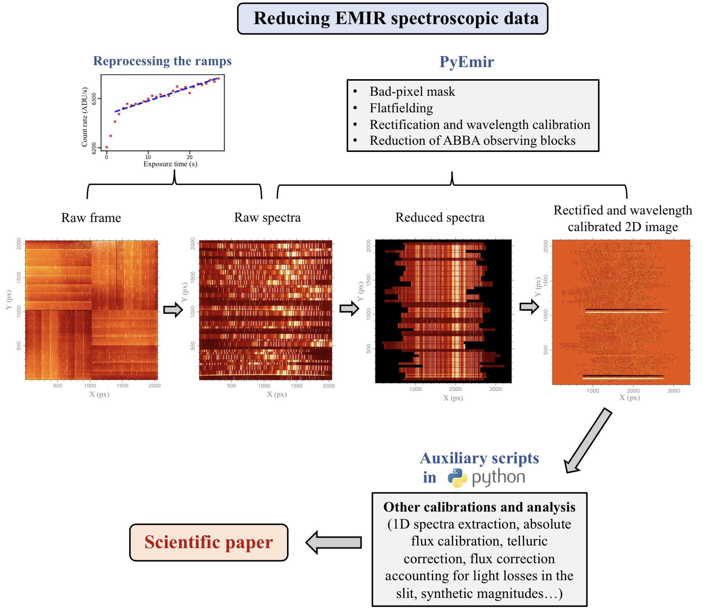

# EMIR

This is the source code repository for the python routines employed to calibrate the infrared spectra from the EMIR MOS spectrograph at GTC obtained after the reduction with the Data Reduction Pipeline PyEmir (https://pyemir.readthedocs.io/en/latest/).

This example shows how to proceed with data reduction of EMIR spectroscopic images from the point at which PyEmir ends, performing the necessary calibrations required to obtain scientifically valuable data.

This software was created by C. Cabello as part of her thesis work, developed under the supervision of N. Cardiel and J. Gallego, at the Departamento de Física de la Tierra y Astrofísica of the Universidad Complutense de Madrid.

The program is first mentioned in Paliya et al. 2020 (see https://ui.adsabs.harvard.edu/abs/2020ApJ...903L...8P/abstract) and Cabello, C. - PhD Thesis 2023.

Maintainer: Cristina Cabello, criscabe@ucm.es 

Webpage (source): https://github.com/criscabe/EMIR

  

